# Proyecto-TJBot_txt
## Manual del ejercicio TJBot en texto
### 2.	PROYECTO TJ BOT

En esta sección vamos a juntar todo lo aprendido anteriormente para construir un TJBot con el  
que poder mantener una conversación. [6] 

  
 
 

Para ello vamos a utilizar una Raspberry Pi3, la cual conectaremos a los servicios de conversación  
de Watson y así poder hacer hablar a nuestro robot.

  
 
 

Para ello vamos a utilizar una Raspberry Pi3, la cual conectaremos a los servicios de conversación  
de Watson y así poder hacer hablar a nuestro robot.

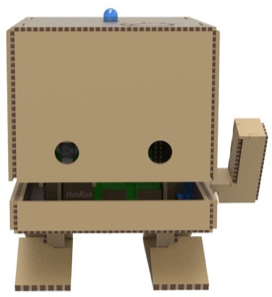  

 El objetivo final será hacer que nuestro TJBot sea capaz de mantener una conversación con nosotros y obedezca algunas órdenes.

<b> 1.1.	CÓMO CREAR A TJBOT </b>  
<b> 1.1.1.	RAPSBERRY PI3 </b>

Raspberry Pi es un computador de placa única.      
Para trabajar con la Raspberry Pi3 vamos a necesitar un   
monitor, un ratón, un teclado y una fuente de  
alimentación para trabajar con ella. También debemos  
tener una tarjeta micro SD con el sistema operativo  
instalado, en este caso trabajaremos con el sistema  
operativo Raspbian.

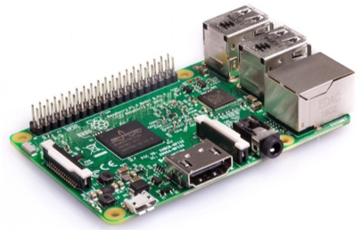   

 Para crear nuestro TJBot hace falta conectar algunos componentes más a nuestra placa: 

 
<ul> 
<li>Un micrófono</li>
<li>Un altavoz</li>
<li>Una cámara</li>
<li>Un servomotor</li>
<li>LED</li>
</ul>

   
<b> 1.2.	MONTANDO A TJBOT </b>  

 
Para comenzar a trabajar con TJBot, lo primero que debemos hacer es obtener las piezas para  
poder montarlo.
   
Este robot es DY (Do it yourself) y puede conseguirse imprimiendo las piezas en una impresora  
3D. Las piezas que se deben imprimir pueden encontrarse en la siguiente web:
      
<a href="https://ibmtjbot.github.io/#gettj"> https://ibmtjbot.github.io/#gettj</a>      
Las piezas que conseguiremos serán las siguientes:    
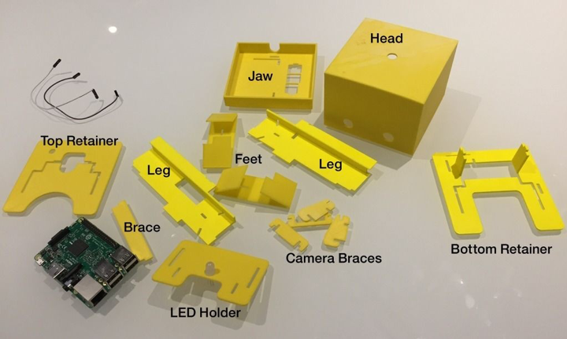      
¿Cómo lo montamos?      

 Primero, insertamos las piernas en la mandíbula. Las piernas entran en los agujeros en forma de  
 L en la mandíbula. Inserta desde la parte superior de la mandíbula hacia abajo. 
      
  

 Después, cogemos la pieza "leg brace". Se encuentra en los dos orificios rectangulares en las  
patas debajo de la mandíbula. Mantiene las piernas rectas y soporta la mandíbula. Debemos  
 asegurar que esté orientada de modo que haga contacto con la parte inferior de la mandíbula. 
    
      

 Ahora, cogemos los pies y los insertamos en las muescas de la pierna como se muestra a  
 continuación. Inserta los pies desde el exterior de cada pierna. 
      
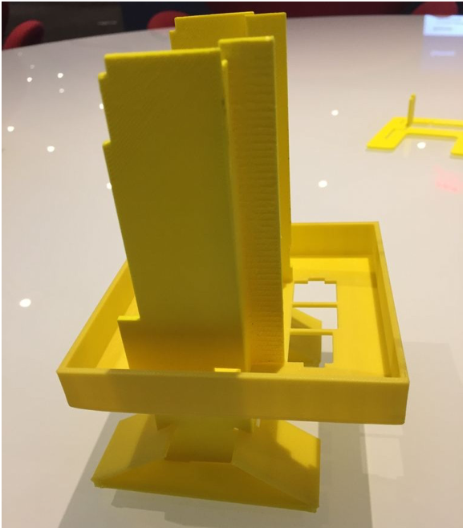      

 Si tenemos un servo motor, es hora de insertarlo en el orificio del lado izquierdo en la mandíbula.  
Cogemos el retenedor inferior y lo deslizamos hacia abajo a través de los agujeros en forma de L  
en las patas. Los brazos de soporte en la parte inferior de este retenedor deben caber en las  
 muescas de acoplamiento en la mandíbula. 
      
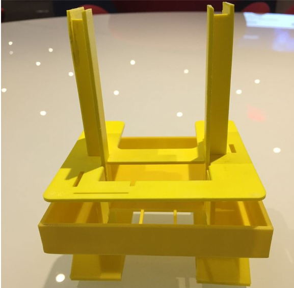      

 A continuación, insertaremos la Raspberry Pi. Se monta boca abajo, con sus puertos expuestos a  
través de los tres agujeros en la mandíbula.    
Si tenemos una cámara: tomamos el soporte de montaje de la cámara. Deslizamos los dos  
montajes laterales de la cámara en las muescas en la parte delantera del retenedor. Deslizamos  
la cámara Pi en el soporte y luego agregue los reforzadores superior y frontal para mantener la  
 cámara ajustada. 
       
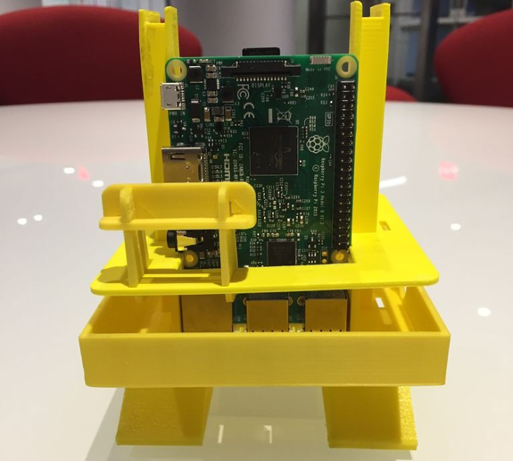      

 El siguiente retenedor es el que tiene el pequeño círculo grabado en él. Lo añadimos a TJBot  
deslizándolo a través de los orificios en forma de L, con el círculo pequeño orientado hacia la  
derecha. Deslizamos el retenedor hacia abajo hasta que se encuentre con la parte superior de la  
 Raspberry Pi.
      
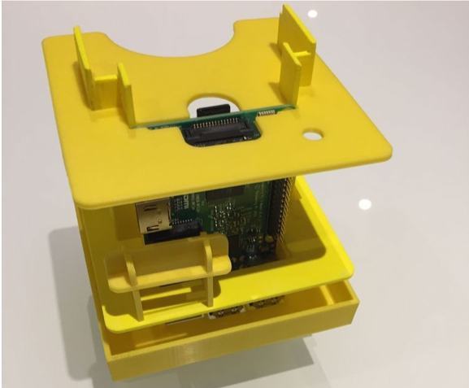      
 
 Insertamos el LED en el orificio central del retenedor pequeño. 
      
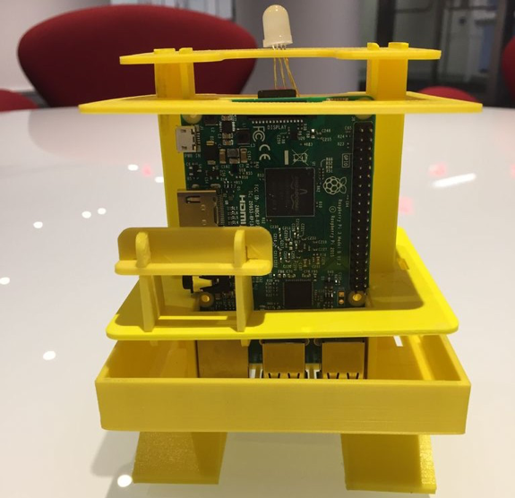      
Por último, colocamos la cabeza.      
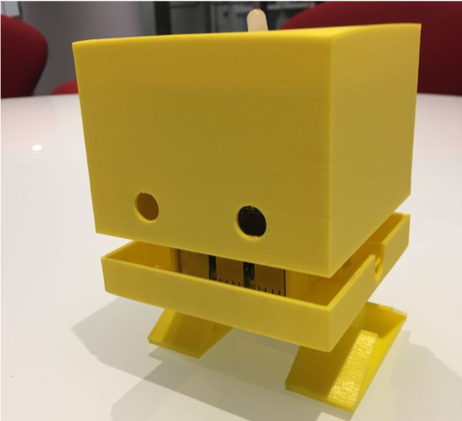      
¡Ya está listo nuestro TJBot!      

  
<b> 1.2.1. CÓMO CONECTAR LOS COMPONENTES </b>    

A continuación, se muestra un esquema de la conexión de los diferentes componentes electrónicos que forman parte de nuestro TJBot.      
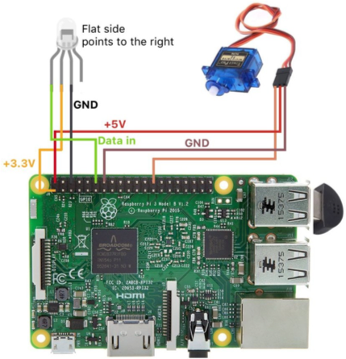    

<b> 1.3.	SERVICIOS DE WATSON </b>  

 Para realizar el proyecto final del TJBot, vamos a utilizar tres servicios de Watson: Text to Speech, 
 Speech to Text y Watson Assistant.

<b> 1.3.1.	TEXT TO SPEECH </b>    

 El servicio Text to Speech proporciona una interfaz de programación de aplicaciones que utiliza   
las capacidades de síntesis de voz de IBM para convertir texto escrito en voz de sonido natural.      
Para crear un servicio Text to Speech de Watson, debemos buscarlo en el catálogo de IBM Cloud.      

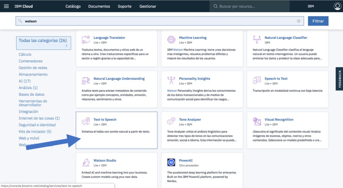    

 Una vez seleccionado el servicio deseado, le damos al botón de "Crear" para poder empezar a trabajar.
    
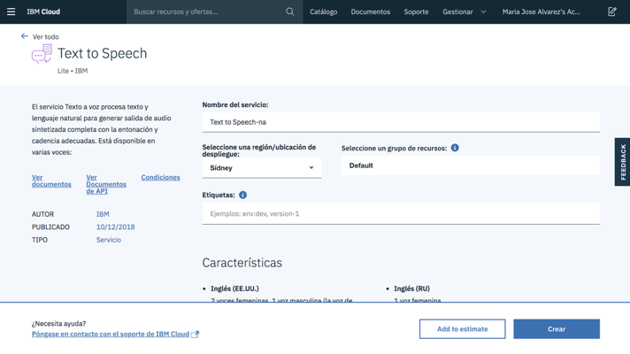    

 Cuando ya tenemos nuestro servicio creado, podemos acceder a él desde nuestro Dashboard.
    
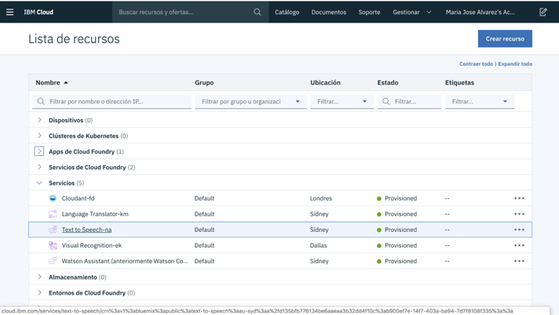    

 En el apartado Service credentials (credenciales del servicio) podemos ver nuestro usuario y  
contraseña, que necesitaremos incluir más adelantes cuando configuremos el servicio Text to  
Speech en nuestra Raspberry Pi3.
  

 ¡Hemos creado nuestro servicio Text to Speech! 
    
<b> 1.3.2.	SPEECH TO TEXT </b>    

 Para crear un servicio Speech to Text de Watson, debemos buscarlo en el catálogo de IBM Cloud.
  
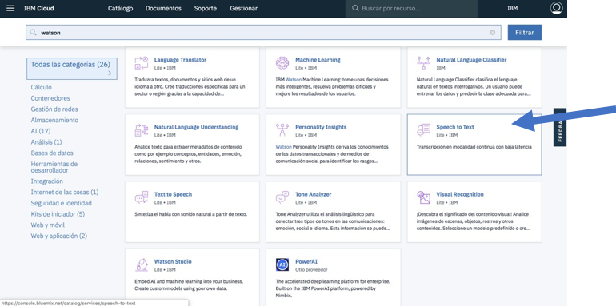    

 Una vez seleccionado el servicio deseado, le damos al botón de "Crear" para poder empezar a trabajar.
    
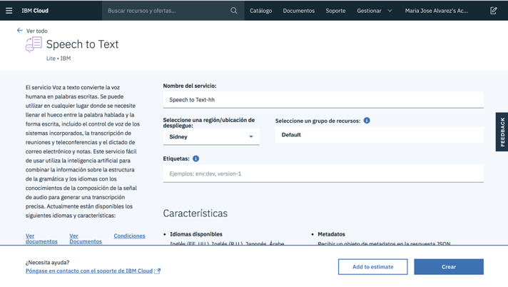    

 Cuando ya tenemos nuestro servicio creado, podemos acceder a él desde nuestro Dashboard.
    
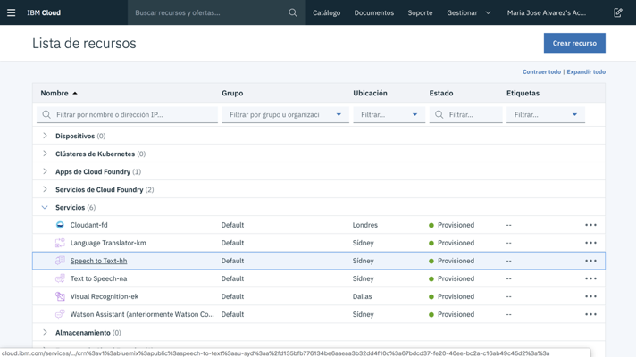    

 En el apartado Service credentials (credenciales del servicio) podemos ver nuestro usuario y  
contraseña, que necesitaremos incluir más adelantes cuando configuremos el servicio Speech to  
Text en nuestra Raspberry Pi3. 
   

¡Hemos creado nuestro servicio Speech to Text!

<b> 1.3.3.	ASSISTANT </b>  

 Para crear un servicio de Watson Assistant, debemos buscar el servicio deseado en el catálogo de IBM Cloud.
    
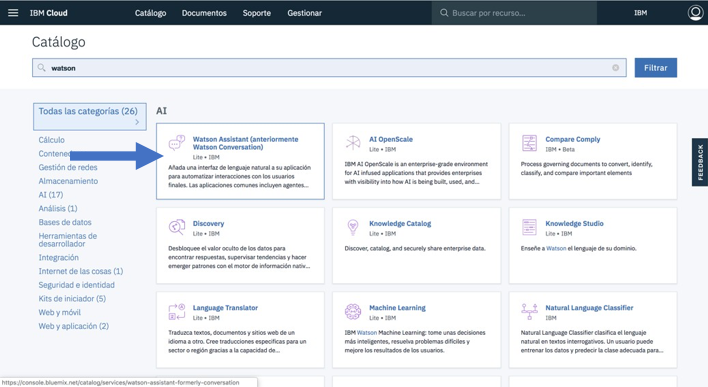    

 Una vez seleccionado el servicio Assistant, le damos al botón de "Crear" para poder empezar a trabajar.
    
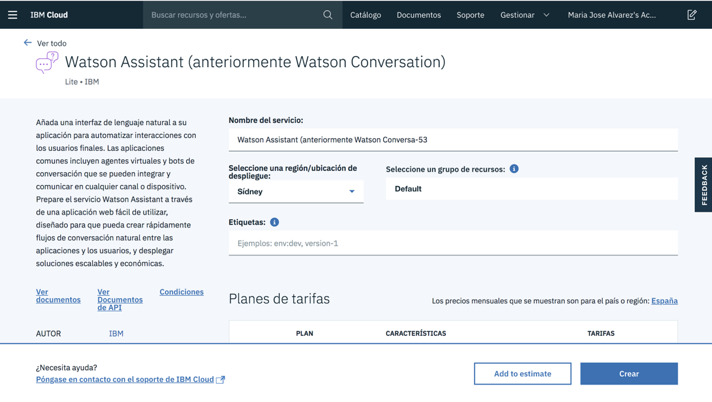    

 Cuando ya tenemos nuestro servicio creado, podemos acceder a él desde nuestro Dashboard. 
Una vez la página principal de nuestro servicio, debemos buscar el botón "Launch tool" que nos llevará a la herramienta  
en la que configuraremos y desarrollaremos nuestra conversación.  
En el apartado Service credentials (credenciales del servicio) podemos ver nuestro usuario y contraseña, que  
 necesitaremos incluir más adelantes cuando configuremos el servicio Assistant en nuestra Raspberry Pi3.    

<b> 1.4.	CONFIGURAR A TJBOT  </b>    
<b> 1.4.1.	CONFIGURAR LA RASPBERRY PI 3  </b>    
Como ya hemos mencionado, Raspberry Pi es similar a un computador completo, lo que significa que se necesita un monitor, ratón y teclado para utilizarla. [1]    
Se puede conectar a un televisor a través de un cable HDMI.  
También será necesario conectar la Raspberry a la Wifi.  
En la mayoría de los kits Pi, la tarjeta SD ya está precargada con una imagen del sistema operativo Raspberry Pi.   
Se debe colocar la tarjeta SD en la Pi, encender la Pi y seguir las instrucciones en la pantalla para completar la  
instalación del sistema operativo.  
Una vez tenemos todo preparado, hay que configurar los paquetes para empezar a trabajar.  
 
 
Abrimos un terminal en el Pi y ejecutamos los siguientes comandos para instalar la última versión de Node.js y  
npm (Node Package Manager). Necesitará estos paquetes más tarde para ejecutar su código.  
Para ello utilizamos el siguiente comando:  
curl -sL http://ibm.biz/tjbot-bootstrap | sudo sh -  
A continuación, será necesario configurar la salida de audio; el audio puede tener 2 opciones:  
HDMI o Jack.  
Abrimos un terminal, y escribimos el siguiente comando, para abrir la configuración de las Raspberry:    
sudo raspi-config  

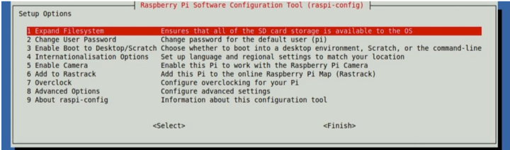    

 Seleccionamos "Opciones avanzadas" y luego seleccionamos "Audio". Elegimos el canal correcto  
para el audio de salida. Si hemos conectado un altavoz externo a la toma de audio, debemos seleccionar la toma de 3,5 mm.

   
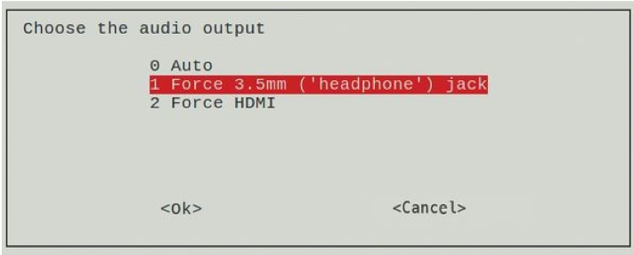    
<b> 1.4.2.	OBTENER EL CÓDIGO PARA TJBOT </b>   

 Una vez tenemos todo configurado, necesitamos descargar el código base para el TJBot.  
Podemos hacerlo mediante los siguientes comandos:     
git clone https://github.com/ibmtjbot/tjbot.git cd tjbot/recipes/conversation  
npm install  
Una vez tenemos el código instalado, tenemos que empezar a configurar los servicios de Watson.  
Como ya hemos dicho, los servicios que vamos a utilizar son 3: Text to Speech, Assistant y Speech to Text.

    

 Recordemos que los tres servicios estaban ya creados; ahora lo único que necesitaremos serán  
las credenciales para poder añadirlas al código de configuración del TJBot.  
Necesitamos abrir el archivo config.js para actualizar dicha información. Para ello, primero  
hacemos una copia del archivo original (config.default.js) mediante el siguiente comando:  
cp config.default.js config.js  
Una vez hecho, abrimos el archive config.js y actualizamos las credenciales de los servicios.  
Será necesaria la password, el username y en el caso de Watson Assistant, el WorkspaceID.  

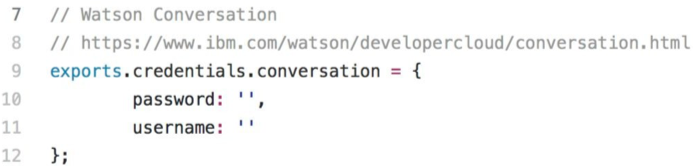    
<b> 1.4.3.	PROBANDO A TJBOT </b>   

 Una vez tenemos todo configurado y la conversación creada, podemos probar a TJBot.  
Abrimos el terminal y ejecutamos el siguiente comando:  
sudo node conversation.js  

<b> ¡Ya puedes hablar con TJBot! </b>

